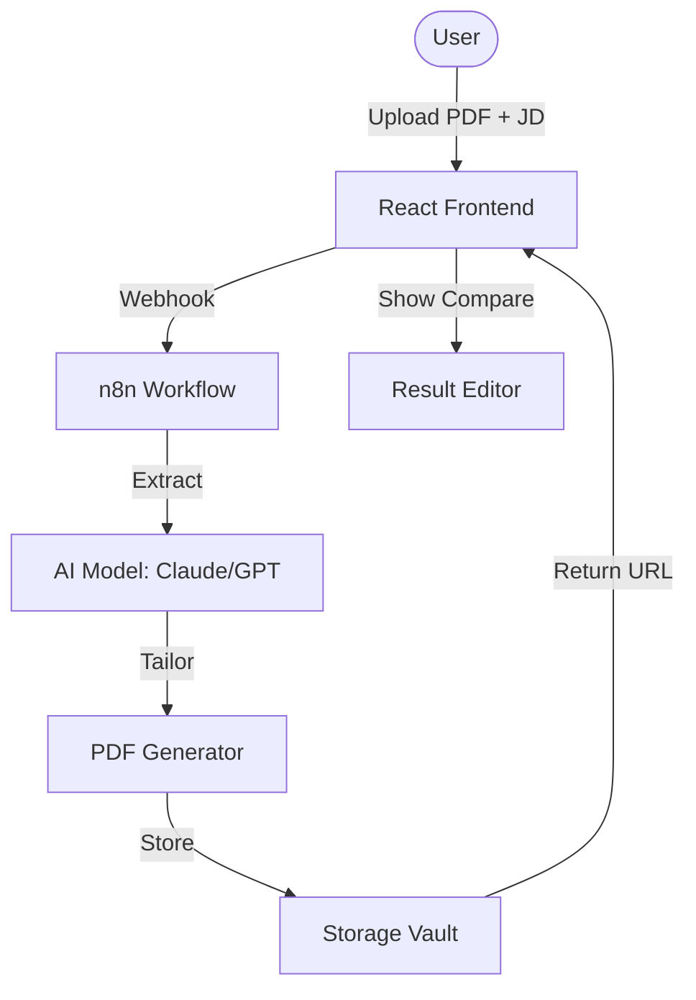

# RESUME.INTEL // AI RESUME TAILORING SYSTEM

A high-fidelity, "Cyber-Minimalist" web platform designed for elite software engineers to automate the tailoring of their professional profiles. Powered by **React** and **n8n**.

---

## 🚀 Quick Start (Local)

1. **Install Dependencies**:
   ```bash
   cd frontend
   npm install
   ```

2. **Run Locally**:
   ```bash
   npm run dev
   ```

3. **Configure n8n Webhook**:
   Copy `frontend/.env.example` to `frontend/.env` and add your `VITE_N8N_WEBHOOK_URL`.

---

## 🏗️ VPS Deployment (Production)

Follow these steps to deploy RESUME.INTEL to your Virtual Private Server (Ubuntu/Debian recommended).

### 1. Provision Infrastructure
We have provided a specialized provisioning script that installs Docker, Nginx, and all Node.js dependencies.

1. **SSH into your VPS**:
   ```bash
   ssh root@your-vps-ip
   ```

2. **Execute Setup**:
   ```bash
   git clone <your-repo-url>
   cd <your-repo-folder>
   chmod +x deployment/setup-vps.sh
   sudo ./deployment/setup-vps.sh
   ```

### 2. Configure Domain & SSL
To ensure secure data transfer (HTTPS), use Certbot to manage your SSL certificates:
```bash
sudo certbot --nginx -d your-domain.com
```

### 3. Connect n8n Dashboard
1. Access n8n at `https://your-domain:5678`.
2. **Import Workflow**: Upload `resume_tailor_workflow.json`.
3. **Webhook URL**: Once your n8n workflow is active, grab the production webhook URL and update your `frontend/.env` file on the VPS.

---

## 🎨 Design System: "Cyber-Minimalist"

The UI is built with a custom **Tailwind CSS** configuration defined in `frontend/index.html`. 

### Core Tokens:
- **Primary**: `#a7a5ff` (Neural Indigo)
- **Secondary**: `#bff365` (Action Neon)
- **Surface**: `#060e20` (Void Blue)
- **Typography**: Space Grotesk (Headlines), JetBrains Mono (Data), Inter (Body).

---

## 🧩 Architecture



---
**System Status: [OPERATIONAL] // V2.0.4**
