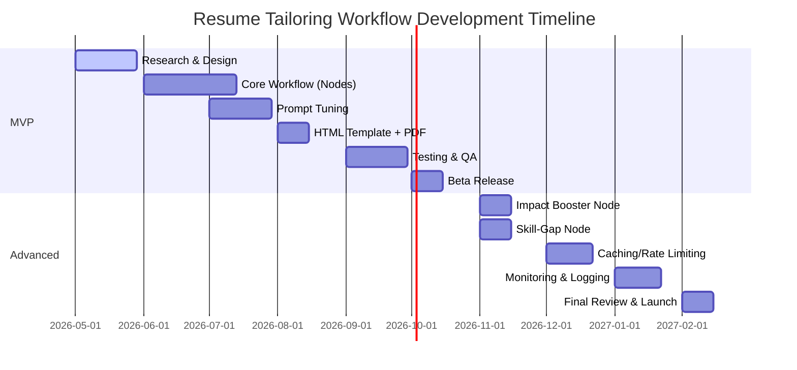

# Executive Summary  
We propose an **“AI Resume Compiler”**: a modular n8n workflow that ingests a PDF resume and a job description, then automatically generates an ATS‑optimized, one‑page resume PDF tailored to that role. This end‑to‑end pipeline uses an n8n webhook trigger for uploads, PDF text extraction, multiple LLM steps (resume parsing, JD analysis, bullet rewriting, impact boosting, skill-gap detection), and a final HTML→PDF conversion. Key considerations include robust error handling (with n8n’s error workflows and retries) and rate‑limit management (with exponential backoff)【23†L1524-L1532】【12†L169-L177】. We compare tools (OpenAI GPT-5.4 and Claude models, PDF extraction APIs like Google Document AI vs AWS Textract, etc.), outline JSON schemas for intermediate data, and provide sample prompts and code snippets. The workflow design is production‑ready: storing outputs securely (e.g. S3 with encryption), handling PII carefully, and validating performance with ATS keyword‑match and readability metrics (e.g. Flesch scores【41†L169-L172】). We conclude with test cases, a rollout roadmap (MVP through advanced features), comparison tables of options, and a Gantt timeline.  

## System Architecture Overview  
At a high level, the workflow looks like:

```mermaid
flowchart LR
    A[Trigger: Webhook/API<br> + Upload Resume PDF & Job Desc] --> B[Extract Resume Text]
    B --> C[LLM 1: Parse Resume to JSON]
    A --> D[LLM 2: Parse JD to JSON]
    C --> E[LLM 3: Generate Tailored Resume (Markdown)]
    D --> E
    E --> F[LLM 4: Impact Booster (rewrite bullets)]
    F --> G[LLM 5: Skill-gap Detector]
    F --> H[HTML Template Renderer]
    H --> I[PDF Renderer]
    I --> J[Store (S3/Drive) + Return Link]
```

Each block above corresponds to n8n nodes detailed below. The workflow creates an **“ATS-friendly resume 1.0”** for each job application, ensuring high keyword match with the JD and concise, impactful writing. By treating the resume like source code compiled per target environment, this design ensures **modularity** (you can swap models/nodes) and **scalability** (batch process many resumes).

## n8n Workflow Details  

### 1. Trigger & Inputs  
- **Trigger Node:** A **Webhook** (POST) or **HTTP Request** node to start the flow. It accepts two inputs: (a) a PDF file (binary data) of the user’s resume, and (b) the job description (as text or link). The webhook returns a 1‑page PDF link at the end.  
- **File Upload Node (optional):** If building a UI, use an `HTTP File Upload` node or custom form to collect the resume PDF.  

### 2. PDF Text Extraction  
We convert the uploaded PDF to plain text. Options:  
- **n8n Built-in**: The **Extract from File** (PDF) node (n8n v1.21+) can parse digital PDF text. It internally uses PDF.js for text extraction【5†L58-L61】. Pros: free, no external API needed. Cons: struggles with scanned images (no OCR), limited language support, some formatting lost.  
- **OCR (Tesseract)**: For image-based PDFs (scans), use a community **Tesseract Node** after Extract. The recommended path is first “Extract from File” for any embedded text, then run a **Tesseract OCR** node on remaining pages【33†L23-L30】. (Future n8n may let Tesseract handle PDFs directly.) Tesseract is free and open-source but has modest accuracy.  
- **Cloud APIs:** High‑accuracy commercial APIs: 
  - **AWS Textract** (OCR, form/table extraction, good on scanned docs)【38†L27-L30】. Pricing: ~$1.50 per 1,000 pages.  
  - **Google Document AI** (Document AI/Form parser) – excels on structured resumes with forms.  
  - **Adobe PDF Extract API** – very high fidelity (reads text order, fonts), but paid by token.  
  - **PDF.co/Parseur** – generic PDF→JSON or text, easy integration via HTTP in n8n.  
  - **PyMuPDF/PDFPlumber** (via a Code node) – free libraries if hosting code, good for simple text.  

These options vary by cost, accuracy, and integration ease. For example, a 2026 survey notes Google/Azure shine on structured docs, Adobe on fidelity, AWS on tables/forms【7†L168-L177】. We can chain Extract + Tesseract for many cases at $0 cost, or use an API for very dirty PDFs.  

### 3. LLM Node 1 – Resume Structuring  
**Goal:** Convert raw resume text into a clean JSON structure (sections, skills, experiences, etc).  
- **Node:** Use an **OpenAI/ChatGPT** or **Anthropic/Claude** chat node.  
- **Prompt (system/user):** You are an expert assistant. **TASK:** “Extract and structure the following resume into JSON with these fields: `Name`, `Summary`, `Skills` (list), `Experience` (list of jobs with company, role, dates, bullet achievements, tech), `Projects` (if any), and `Education` (degrees). Output strictly valid JSON.”  
- **Example Prompt:** 
  ```
  SYSTEM: You are a resume parser. OUTPUT must be JSON.
  USER: Convert this resume text into structured JSON. Extract fields: Name, Contact (email, phone), Summary, Skills (bullets), Experience (company, role, dates, bullets), Education, Projects, Certifications.
  Resume text:
  [paste resume text]
  ```  
- **Output:** A JSON object like:
  ```json
  {
    "Name": "Jane Doe",
    "Contact": {"email": "...", "phone": "..."},
    "Summary": "...",
    "Skills": ["Python", "SQL", "..."],
    "Experience": [
      {
        "Company": "Acme Corp",
        "Role": "Backend Engineer",
        "StartDate": "2020-01",
        "EndDate": "2023-06",
        "Bullets": ["Implemented X (improved Y by Z%)", "Led project ..."],
        "Tech": ["Python","Flask"]
      },
      { ... }
    ],
    "Education": [ ... ],
    "Projects": [ ... ]
  }
  ```  
This **JSON schema** will be our internal data layer. It is reusable (we feed it to other nodes) and serves as a canonical resume. The prompt should enforce JSON output (e.g. use <code>OUTPUT must be valid JSON</code> and perhaps n8n’s “Response Format” field if available).  

### 4. LLM Node 2 – Job Description Analysis  
**Goal:** Parse the job description to identify keywords, required and preferred skills.  
- **Node:** OpenAI/ChatGPT or Claude chat node.  
- **Prompt:** “Analyze this job description and extract: 1) Most critical hard skills (top 5), 2) Key soft skills (top 3), 3) Required certifications/qualifications, 4) Industry-specific terms/keywords, 5) Action verbs. Output a JSON object with keys: `keywords`, `must_have_skills`, `nice_to_have`, `certifications`, etc.”  
- **Example Prompt:** 
  ```
  SYSTEM: You are a job analysis assistant. OUTPUT JSON.
  USER: Here is a job description. Identify: required hard skills, preferred skills, key ATS keywords, responsibilities. Format as JSON lists.
  JD:
  [paste job description]
  ```  
- **Output Schema:**  
  ```json
  {
    "keywords": ["React","AWS","microservices","collaborate","scrum"],
    "must_have_skills": ["JavaScript","Node.js","GraphQL"],
    "nice_to_have_skills": ["Docker","Kubernetes"],
    "certifications": ["AWS Certified Developer"],
    "responsibilities": ["lead feature development","mentor juniors"]
  }
  ```  
This aligns with best practices: a resume tailored to a role must echo its keywords【15†L179-L187】. For example, one guide suggests asking ChatGPT: “Analyze this job description... output prioritized list with keyword frequency analysis”【18†L174-L183】. The output JSON lets our next step use concrete skill and keyword lists for alignment.  

### 5. LLM Node 3 – Tailored Resume Generation  
**Goal:** Using the structured resume JSON and JD JSON, produce a one-page resume focused on the job.  
- **Node:** OpenAI/ChatGPT (strong model, e.g. GPT-5.4 or Claude Sonnet).  
- **Prompt:** 
  ```
  SYSTEM: You are an expert technical resume writer optimizing for ATS. 
  TASK: Tailor the resume to the job. Rules:
    - Keep to 1 page.
    - Use strong action verbs and quantify impact (metrics).
    - Prioritize experience matching JD.
    - Inject relevant keywords naturally.
    - Drop or condense unrelated info.
  INPUT:
    Structured Resume JSON: {{resume_json}}
    Job Requirements JSON: {{jd_json}}
  OUTPUT: A Markdown resume text (with sections like Summary, Skills, Experience, Education).
  ```  
- **Output:** Markdown for the resume, e.g.:  
  ```markdown
  # Jane Doe — Software Engineer
  **Location:** City, Country • **Email:** jane@example.com • **Phone:** +1234567890
  
  ## Summary
  Accomplished backend engineer with 5+ years in SaaS. Expertise in Python, AWS, and microservices. Increased system throughput by 30% at Acme Corp.
  
  ## Skills
  Python, SQL, AWS, Docker, REST APIs, Agile/Scrum, Unit Testing
  
  ## Experience
  **Acme Corp** (2020–2023) — Software Engineer  
  - Led development of XYZ service, improving performance by 30% (Python, Flask, AWS).  
  - Mentored 3 junior devs and instituted code review process.  
  - Collaborated cross-functionally to migrate systems to microservices.
  
  **Beta Co** (2017–2020) — Backend Engineer  
  - Built data pipeline for analytics platform, processing 10M events/day.  
  - Optimized database queries, reducing latency by 40%.
  
  ## Education
  B.Sc. in Computer Science, University X (2013–2017)
  ```  

This node is the **core “magic”** that does the tailoring. It follows the framework in AI‑resume guides: use action verbs, metrics, and ATS keywords【15†L179-L187】. For example, Teal’s prompts emphasize including metrics and keywords from the JD【15†L179-L187】. We enforce rules to control output length and style.  

### 6. LLM Node 4 – Impact Booster (Optional)  
**Goal:** Further enhance bullet points by adding or improving metrics.  
- **Node:** ChatGPT or Claude (smaller model is fine).  
- **Prompt:** 
  ```
  SYSTEM: You are a writing coach for resumes. 
  TASK: Rewrite these achievement bullet points to emphasize impact (add metrics where plausible).
  INPUT bullet list from resume.
  ```  
- **Example:** Input: “Improved page load time by redesigning front-end.” Output: “Redesigned front-end, improving page load time by 50%.”  
This step is optional but valuable. AI can inflate metrics, so output should be reviewed manually.  

### 7. LLM Node 5 – Skill-Gap Detector (Optional)  
**Goal:** Compare resume skills to JD skills and highlight missing ones.  
- **Node:** ChatGPT or simple function.  
- **Prompt:** 
  ```
  SYSTEM: You are an analyst. 
  TASK: Compare Resume JSON and JD JSON. List any skills or keywords in the JD that do NOT appear in the resume. Output JSON list `missing_skills`.
  ```  
- **Use:** We might email these suggestions or append to output. It guides the user on what to add next time.  

### 8. HTML Template & PDF Conversion  
- **HTML Template:** Take the Markdown from LLM 3 (or 4) and convert to HTML. Use an **n8n Markdown** node or a function. Wrap content in a clean, ATS‑friendly HTML template. For example:  
  ```html
  <html>
    <head>
      <style>
        body { font-family: Arial, sans-serif; margin: 0 1in; }
        h1 { font-size: 24px; margin-bottom: 0; }
        h2 { font-size: 18px; margin-top: 1em; }
        ul { margin: 0 0 1em 1.2em; }
      </style>
    </head>
    <body>
      <!-- Inject Markdown-as-HTML content here -->
      {{resume_html}}
    </body>
  </html>
  ```  
  This template uses standard fonts and linear layout (no tables or multi‑column) so ATS systems parse it properly. (ATS usually prefer `<ul>` lists and headings, and avoid images/CSS complexities.) We’ll embed the generated content via a n8n “HTML node” or Code node.  
- **ATS Tip:** Avoid graphics or unconventional section tags. Use full section names (“Experience”, “Education”).  

- **PDF Rendering:**  
  - **n8n Node (PDFMunk):** n8n provides an **“HTML to PDF”** integration (via PDFMunk/PDFShift under the hood)【30†L75-L83】. This is easy to use but may have rate limits or branding depending on plan.  
  - **External API:** e.g. **PDFShift** (cloud API, free tier)【44†L78-L86】, **PDFCrowd**, **DocRaptor**. These take HTML and return a PDF.  
  - **Self-Hosted:** Tools like **wkhtmltopdf** (Open Source, uses WebKit)【44†L31-L39】 or **WeasyPrint** (Python) can be installed on the n8n host and called via a command/Code node. They offer highest fidelity and no per-request cost, but require server setup.  
  - **Choice:** For simplest setup, using n8n’s built-in PDF node is easiest. For full control, wkhtmltopdf (open-source, free) is unbeatable【44†L31-L39】. PDFShift (cloud) is a good SaaS with free tier【44†L78-L86】.  

### 9. Storage & Output  
- **Store PDF:** The final PDF can be saved to cloud storage (e.g. AWS S3, Google Drive, Supabase Storage). n8n has nodes for **S3** and **Google Drive**. S3 is scalable and can enable presigned download links.  
- **Security:** Use SSL/TLS for the webhook and any API calls. Encrypt sensitive storage (S3 has automatic encryption-at-rest). For PII (name, contact), we could omit social security numbers or addresses if present. We should delete the stored resume PDF after processing or store only with strict access control.  
- **Return Link:** The webhook response should include a download link or directly attach the PDF (as binary response). n8n can return binary data over the webhook by setting the node accordingly.  

## Data Schemas (JSON)  

**Structured Resume JSON:** (example)  
```json
{
  "Name": "Jane Doe",
  "Contact": {"email":"jane@example.com","phone":"+1-234-567-8901"},
  "Summary": "Software engineer with 5+ years in SaaS...",
  "Skills": ["Python","SQL","AWS","Docker"],
  "Experience": [
    {
      "Company": "Acme Corp",
      "Role": "Backend Engineer",
      "StartDate": "2020-01", "EndDate": "2023-06",
      "Bullets": ["Developed X","Improved Y by 30%"],
      "Tech": ["Python","Flask","PostgreSQL"]
    },
    { ... }
  ],
  "Education": [
    {"Institution":"University X","Degree":"B.Sc. Computer Sci","StartYear":2013,"EndYear":2017}
  ],
  "Projects": [
    {"Name":"Project Z","Description":"Built a REST API for ...","Tech":["Django","Docker"]}
  ]
}
```  
Fields like dates should use ISO or YYYY-MM format. Skills can be a simple list of strings. Keep it simple for LLM parsing. This JSON is used as input for tailoring and checking.  

**Job Description JSON:**  
```json
{
  "title": "Senior Backend Engineer",
  "company": "TechCo",
  "keywords": ["Kotlin","Spring","microservices","collaboration"],
  "must_have_skills": ["Java","Spring Boot","SQL"],
  "nice_to_have": ["AWS","Docker","Agile"],
  "certifications": ["Oracle Certified Professional"],
  "responsibilities": ["design APIs","lead agile teams"]
}
```  
This schema captures extracted info. It may be customized (e.g. include `location`, `level`, etc.). The key is having `keywords`, `must_have_skills`, and optionally `nice_to_have`.

## Error Handling & Rate Limiting  
- **Error Workflows:** n8n supports a separate **Error Workflow** triggered by an **Error Trigger** node【23†L1524-L1532】. We should attach an error workflow that logs failures and sends alerts (email/Slack) if something breaks. Within the main flow, set "Continue On Fail" carefully.  
- **Retries:** For nodes that call APIs (OpenAI, PDF services), enable retries with exponential backoff on 429/5xx errors. For example, after a 429, wait a few seconds and retry up to 3 times.  
- **Rate Limits:** Monitor API headers (OpenAI returns X-RateLimit-Remaining). We should batch calls if possible. Since we’re doing ~5 LLM calls per run, ensure usage stays below quotas. Cache prompts (save completed prompts/responses) for similar jobs to avoid repeats. If using OpenAI, remember TMP (tokens/minute) limits; for high volume consider "Priority" processing or scaling keys. The best practice is exponential backoff on 429【12†L169-L177】, and realistic `max_tokens` (don’t overshoot response length)【12†L183-L192】.  
- **Parallelism:** If running many resumes, queue them so as not to trigger concurrent rate limits. n8n’s execution queue or a third-party job queue can help.  

## Token/Cost Estimates (OpenAI/Claude)  
We assume using modern LLMs (pricing as of 2026):  

| Model           | Context | Input $/1M tok | Output $/1M tok | Notes |
|-----------------|---------|---------------|-----------------|-------|
| OpenAI GPT-5.4  | 270K    | $2.50【10†L39-L46】   | $15.00【10†L43-L47】    | High-capability (capable of nuanced rewrites). |
| OpenAI GPT-5.4-mini | 270K | $0.75【10†L52-L60】  | $4.50【10†L55-L61】    | Cheaper, still strong for code/logic. |
| OpenAI GPT-5.4-nano | 270K | $0.20【10†L69-L76】  | $1.25【10†L69-L76】    | Fast & cheap, lower quality (maybe for simple parse). |
| Claude Sonnet 4.6 | 1,000K | $3【28†L252-L259】    | $15【28†L252-L259】    | Very large context (1M tokens)【36†L13-L16】. Great reasoning. |
| Claude Haiku 4.5  | ~100K? | $1【28†L252-L259】    | $5【28†L252-L259】     | Small context, inexpensive (good for short tasks). |

*Token Usage Estimate:* A typical resume (~2 pages) has ~2000 words (~3000 tokens) plus JD (~1000 tokens). Structured parsing might output ~500 tokens JSON. Tailored resume output ~300 tokens Markdown. Impact booster ~100 in/out. Total ~4500 input, ~2000 output tokens per full run. Using GPT-5.4-mini: cost ≈ $(4500/1e6)*0.75 + (2000/1e6)*4.5 ≈ $0.011. Using GPT-5.4: ≈ $0.0025*4500 + $0.015*2000 ≈ $0.0135. Claude Haiku: $(4500/1e6)*1 + (2000/1e6)*5 ≈ $0.0115. So roughly **$0.01–$0.03 per resume**. At scale, budget accordingly. Caching heavy prompts (like system instructions) also saves tokens (Claude’s prompt caching can cut input cost【28†L322-L330】).

## Storage & Security  
- **Storage:** Use secure cloud storage. *Example:* AWS S3 with server-side encryption. Configure n8n’s **S3 node** to upload PDF and generate a presigned URL for download. Or **Google Drive** integration to place the PDF in a secured folder. If storing in a database (e.g. Supabase storage), ensure authentication.  
- **Encryption & PII:** All files and DB entries should be encrypted-at-rest. Only store minimal personal data needed. Mask or exclude sensitive PII (SSNs, etc.). Over HTTPS for all transfers. For added privacy, consider hashing filenames or expiring links after use.  
- **Compliance:** If this handles real resumes, consider GDPR/CCPA: get user consent for data processing, and allow deletion of their data.  

## HTML/ATS-Friendly Template (Example)  
Below is a simple one-page HTML+CSS template optimized for ATS (no tables, minimal styling):

```html
<!DOCTYPE html>
<html>
<head>
  <meta charset="UTF-8">
  <title>{{Name}} — Resume</title>
  <style>
    body { font-family: Arial, sans-serif; margin: 0; padding: 1in; color: #222; }
    h1 { font-size: 24px; margin-bottom: 0; }
    h2 { font-size: 18px; margin-top: 1em; border-bottom: 1px solid #888; padding-bottom: 2px; }
    p, li { font-size: 12px; line-height: 1.2; margin: 4px 0; }
    ul { margin: 4px 0 12px 20px; }
    .contact { font-size: 10px; margin-top: 2px; }
  </style>
</head>
<body>
  <h1>{{Name}}</h1>
  <div class="contact">{{Contact.email}} | {{Contact.phone}} | {{Location}}</div>
  <h2>Summary</h2>
  <p>{{Summary}}</p>
  <h2>Skills</h2>
  <p>{{Skills.join(", ")}}</p>
  <h2>Experience</h2>
  {{#each Experience}}
    <p><strong>{{this.Company}}</strong> — {{this.Role}} ({{this.StartDate}} – {{this.EndDate}})</p>
    <ul>
      {{#each this.Bullets}}
        <li>{{this}}</li>
      {{/each}}
    </ul>
  {{/each}}
  <h2>Education</h2>
  <p>{{Education[0].Degree}}, {{Education[0].Institution}} ({{Education[0].StartYear}}–{{Education[0].EndYear}})</p>
</body>
</html>
```
*(In practice, the templating markers like `{{Name}}` would be replaced with the Markdown content converted to HTML.)* This layout uses clear headings and lists – ATS systems read this predictably【41†L169-L172】. Notice minimal styling and standard fonts for compatibility.  

## PDF Rendering Options (Comparison)  
| Tool        | Type            | Integration         | Cost         | Notes                                      |
|-------------|-----------------|---------------------|--------------|--------------------------------------------|
| **wkhtmltopdf**【44†L31-L39】 | Open-source CLI | Self-host (install) | Free         | High fidelity (WebKit engine), offline. Best control. Requires server setup. |
| **PDFShift**【44†L78-L86】   | Cloud API       | n8n HTTP node       | $0+ (free tier) | Fast, scalable, customizable headers. Requires internet. |
| **WeasyPrint**【44†L50-L58】 | Python lib      | Code node (Python) | Free         | Good CSS support. Easier with Python know-how. |
| **n8n PDF node** (PDFMunk)  | Cloud API       | Built-in n8n        | Depends on plan | Built-in with n8n, simple. May use PDFMunk/PDFShift. |
| **Puppeteer** (Headless Chrome) | JS library  | Code node (NodeJS)  | Free         | Very accurate, handles modern CSS/JS. Heavy to run. |
| **DocRaptor**, **PDFCrowd** | Cloud API       | HTTP Request node   | Paid (free trials) | Commercial APIs (wkhtmltopdf-based), easy to use, but add watermark on free plan. |

The best choice depends on budget and complexity. For most enterprises, either the n8n node or PDFShift (cloud) is sufficient. For maximum customization and no vendor lock-in, wkhtmltopdf is recommended【44†L31-L39】.  

## Sample n8n Workflow (JSON Snippets)  
Below is a *partial* n8n workflow definition (JSON) illustrating key nodes. This is not full valid JSON (fields omitted for brevity) but shows node types and parameters:

```jsonc
{
  "nodes": [
    {
      "id": "1",
      "name": "Webhook Trigger",
      "type": "n8n-nodes-base.webhook",
      "parameters": {
        "httpMethod": "POST",
        "path": "tailor-resume",
        "responseMode": "onReceived"
      }
    },
    {
      "id": "2",
      "name": "Extract from File",
      "type": "n8n-nodes-base.extractFromFile",
      "parameters": {
        "binaryProperty": "data"  // Read PDF from webhook
      }
    },
    {
      "id": "3",
      "name": "Parse Resume (LLM)",
      "type": "n8n-nodes-base.openAI",
      "parameters": {
        "model": "gpt-5.4", 
        "userPrompt": "Convert the resume text to JSON as specified..."
      }
    },
    {
      "id": "4",
      "name": "Parse JD (LLM)",
      "type": "n8n-nodes-base.openAI",
      "parameters": {
        "model": "gpt-5.4",
        "userPrompt": "Analyze job description; output JSON of skills/keywords..."
      }
    },
    {
      "id": "5",
      "name": "Tailor Resume (LLM)",
      "type": "n8n-nodes-base.openAI",
      "parameters": {
        "model": "gpt-5.4",
        "userPrompt": "Using Resume JSON and JD JSON, write a tailored resume in Markdown..."
      }
    },
    {
      "id": "6",
      "name": "Markdown to HTML",
      "type": "n8n-nodes-base.markdown",
      "parameters": {
        "markdown": "={{$node[\"Tailor Resume (LLM)\"].json[\"content\"]}}"
      }
    },
    {
      "id": "7",
      "name": "HTML to PDF",
      "type": "n8n-nodes-base.pdfmunk",  // HTML PDF conversion
      "parameters": {
        "binaryProperty": "data",
        "html": "={{$node[\"Markdown to HTML\"].json[\"html\"]}}"
      }
    },
    {
      "id": "8",
      "name": "Upload to S3",
      "type": "n8n-nodes-base.s3",
      "parameters": {
        "operation": "upload",
        "bucketName": "resume-outputs",
        "fileName": "tailored_resume.pdf",
        "binaryProperty": "data"
      }
    }
  ],
  "connections": {
    "Webhook Trigger": {"main": [[{"node":"Extract from File","type":"main","index":0}]]},
    "Extract from File": {"main": [[{"node":"Parse Resume (LLM)","type":"main","index":0}]]},
    "Parse Resume (LLM)": {"main": [[{"node":"Tailor Resume (LLM)","type":"main","index":0}]]},
    "Parse JD (LLM)": {"main": [[{"node":"Tailor Resume (LLM)","type":"main","index":1}]]},
    "Tailor Resume (LLM)": {"main": [[{"node":"Markdown to HTML","type":"main","index":0}]]},
    "Markdown to HTML": {"main": [[{"node":"HTML to PDF","type":"main","index":0}]]},
    "HTML to PDF": {"main": [[{"node":"Upload to S3","type":"main","index":0}]]}
  }
}
```

This snippet shows key nodes: a Webhook trigger, PDF extraction, multiple LLMs, and HTML→PDF. In practice, you’d flesh out each node’s parameters (prompts, timeouts, credentials, etc.). Note how “Parse Resume (LLM)” and “Parse JD (LLM)” feed into “Tailor Resume (LLM)” on different input branches.  

## Test Cases  
- **Case 1:** Clean 2-page digital resume + matching JD. Check that the output is 1-page, includes key skills from JD, and omits unrelated roles.  
- **Case 2:** Scanned PDF resume (image). Verify OCR fallback: "Extract from File" yields nothing, but Tesseract extracts text.  
- **Case 3:** Overstuffed resume (5+ pages). Ensure tailing engine compresses it.  
- **Case 4:** Mismatched JD (e.g. Junior role vs Senior resume). The system should downplay high-level items or rephrase.  
- **Case 5:** Edge: Missing skills. The skill-gap detector should list JD skills not in resume.  

Each test verifies: correctness (matches JD), formatting (PDF looks good), and performance (completion without timeouts).  

## Evaluation Metrics  
We must quantify "tailoredness" and quality:  
- **ATS Keyword Match:** Use an ATS scoring tool or simply count how many top JD keywords appear in the final resume. Goal: include all *must-have* keywords. (Studies show ATS filter ~25% of resumes, so maximizing matches is key【18†L100-L108】.)  
- **Readability:** Compute Flesch Reading Ease or Grade Level. Aim for Flesch score ~60–70 (8th–9th grade) – easy for recruiters【41†L169-L172】. Very complex sentences can drop readability. We should ensure bullet points are concise.  
- **Length:** Confirm the PDF is one page (word count ~400–600). Enforce one-page by prompt rules and checking final output length programmatically.  
- **Grammar/Spelling:** Automated grammar check (or a human review sample) to ensure AI didn’t hallucinate credentials.  
- **Manual Review:** Recruiter feedback: Are bullets realistic and credible? (LLMs can overstate impact.)  

## Rollout Plan (MVP → Advanced)  

- **MVP (Months 1–5):** Build basic end‑to‑end: PDF extract → LLM tailing → PDF. Use default prompts and n8n nodes. Basic error handling.  
- **Phase 2 (Months 6+):** Add polish: impact-metrics booster, skill-gap report, prompt caching for cost savings, better error workflow. Add logging/analytics (e.g. log ATS scores). Use a dashboard to monitor usage and hit rates.  
- **Scaling:** After internal validation, expose as a service. Monitor API quotas (OpenAI usage) and apply for higher tiers if needed.  

## Tool & API Comparisons  

**LLM Models (2026):**

| Model              | Context Window | Input Cost | Output Cost | Pros/Cons |
|--------------------|----------------|------------|-------------|-----------|
| **GPT-5.4** (OpenAI)       | 270K           | \$2.50/1M【10†L39-L46】 | \$15/1M【10†L39-L46】 | Very high quality, great at understanding prompts; expensive for long outputs. |
| **GPT-5.4-mini**            | 270K           | \$0.75/1M【10†L52-L60】 | \$4.50/1M【10†L52-L60】 | Strong coder/model performance; cost-effective; ideal for structured tasks. |
| **GPT-5.4-nano**            | 270K           | \$0.20/1M【10†L69-L76】 | \$1.25/1M【10†L69-L76】 | Cheap & fast; limited reasoning/length; good for small jobs (e.g. JSON parse). |
| **Claude Sonnet 4.6**       | 1M【36†L13-L16】 | \$3/1M【28†L252-L259】  | \$15/1M【28†L252-L259】 | 1M token context, excellent coherence; similar output cost to GPT-5.4-mini. |
| **Claude Haiku 4.5**        | ~~100K?        | \$1/1M【28†L252-L259】  | \$5/1M【28†L252-L259】  | Lower capacity, but very cheap; fine for short parses (JD keywords, bullet edits). |
| **Google Gemini Ultra**     | 2M (announced)| (private)  | (private)   | Very large context; unannounced pricing (likely premium).  |
| **Open Source (e.g. Mistral)** | ~32K        | Free on self-host | Free         | No API cost; lower quality/length; complex infra to self-host. |

*Sources:* OpenAI and Anthropic pricing docs【10†L39-L47】【28†L252-L259】. As a rule, cheap models (nano/Haiku) can handle straightforward extraction tasks, while flagship models (GPT-5.4, Claude Opus) should handle the final drafting and hardest reasoning.  

**PDF Extraction Tools:**

| Tool                   | Output               | API/Integrations                | Pricing         | Notes                              |
|------------------------|----------------------|---------------------------------|-----------------|------------------------------------|
| **Google Document AI** | Structured JSON      | Google Cloud SDK/API            | Pay-as-you-go   | Best for complex docs/forms【7†L168-L177】. Good OCR, form parsing. |
| **Azure Doc Intelligence** | Structured JSON  | Azure SDK/API                   | Pay-as-you-go   | Similar to Google (invoice/receipt models). |
| **Adobe PDF Extract**  | JSON (layout/Text)   | Adobe PDF Services API【7†L168-L177】 | Paid (consumption) | Very high fidelity (reads text order, rich formatting). |
| **AWS Textract**       | JSON (KVP/Table)     | AWS SDK/API                     | \$1.50 per 1k pages | Solid for tables/forms【7†L168-L177】; good for scanned text. |
| **Parseur/PDF.co**     | JSON/Text            | REST API, Zapier, n8n           | Tiered (free/trial) | Flexible “turn PDFs into JSON”. Easy to integrate. |
| **n8n Extract node**   | Text (if digital)    | Built-in node                   | Free            | No cost, but limited (no OCR on scans)【33†L23-L30】. |
| **Tesseract OCR**      | Text (image)         | n8n community node              | Free            | Good for scanned pages; free but accuracy varies. |

From a 2026 analysis: Google/Azure excel at structured data extraction (forms, invoices), Adobe at document fidelity, and AWS/Textract at key-value tables【7†L168-L177】. For resumes (mostly text), even open-source or built‑in parsing may suffice.  

**HTML→PDF Tools:**

| Tool           | Type       | Cost            | Pros/Cons                             |
|----------------|------------|-----------------|---------------------------------------|
| **wkhtmltopdf**【44†L31-L39】 | Open-source CLI | Free            | Very accurate (WebKit engine). 100% free; works offline. Needs install. |
| **WeasyPrint**【44†L50-L58】 | Python lib | Free            | Produces accessible PDFs; good for Python stacks. Slightly slower. |
| **PDFShift**【44†L78-L86】   | Cloud API  | Freemium        | Fast, free tier, easy integration. Limited by internet/API usage. |
| **DocRaptor/PDFCrowd** | Cloud API  | Paid (has free plan with watermark) | Easy to use (HTML/URL→PDF). Industry-grade, but cost for heavy use. |
| **n8n PDFMunk Node** | Cloud integration | Depends on plan | Built into n8n; likely uses wkhtmltopdf. Convenient, may have usage limits. |

See comparison【44†L31-L39】【44†L78-L86】: wkhtmltopdf is unbeatable for control, PDFShift is great for quick API-driven PDFs.  

## Conclusion  
This design yields a fully automated, end-to-end resume tailoring service. It decomposes the problem into modular steps (text extraction, JSON structuring, LLM rewriting, formatting), each with technology choices and fallback options. By enforcing clear prompt rules and JSON schemas, we maintain structure and can iterate on individual components. We leverage n8n’s flexibility (no‑code nodes plus custom code if needed) and modern LLMs to ensure the output is both **ATS-friendly and high-quality**. With proper error handling and monitoring, this system scales to thousands of resumes, giving candidates a “custom‑tailored suit” of a resume for every job.  

**Sources:** We referenced n8n docs and community sources for extraction nodes【5†L58-L61】【33†L23-L30】, OpenAI/Claude pricing【10†L39-L47】【28†L252-L259】, LLM prompt advice【15†L72-L80】【15†L179-L187】【18†L174-L183】, PDF tool comparisons【7†L168-L177】【44†L31-L39】【44†L78-L86】, and best practices for rate limiting【12†L169-L177】. Each choice is grounded in up-to-date (2026) documentation and analyses.